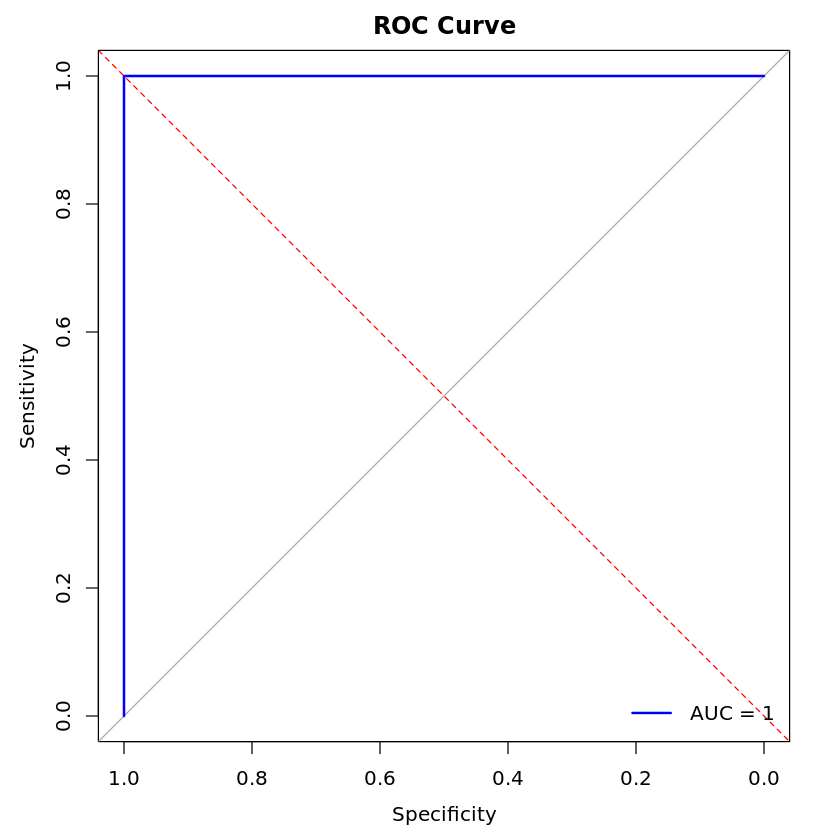

    [1] "Problem 1:Saratoga house prices"

    [1] "Before fitting the best linear model, I run some simply model aiming to find the alternative RMSE number. There are three simply models: lm1, with lotSize, bedrooms and bathrooms as features."
    [1] "lm2, without pctCollege, sewer, waterfront, landValue and newConstruction. And lm3, without features afore-mentioned and square the rest features. Their RMSE are displayed following."
    [1] "From the result, we drop lm1 model."
    [1] "RMSE"
    [1] "linear model with three features lotSize, bedrooms and bathrooms: 81946.900195026"
    [1] "linear model exclude pctCollege, sewer, waterfront, landValue, newConstruction: 71494.2424168182"
    [1] "linear model exclude pctCollege, sewer, waterfront, landValue, newConstructionand squared: 71501.6631795597"

    [1] "In order to address random variation due to the particular choice of data points that end up in train/test split, I loop the split process 100 times. "
    [1] "Average RMSE of model 2 for 100 times split: 66652.2281946853"
    [1] "Average RMSE of model 3 for 100 times split: 71729.2865820363"

    [1] "Then we build the medium model and see what features are the most important."
    [1] "As we can see from the list of model feature significance, livingArea, bedrooms, bathrooms and centralAirNo are the most significant."

    
    Call:
    lm(formula = price ~ lotSize + age + livingArea + pctCollege + 
        bedrooms + fireplaces + bathrooms + rooms + heating + fuel + 
        centralAir, data = saratoga_train)
    
    Residuals:
        Min      1Q  Median      3Q     Max 
    -239141  -38863   -7801   28286  460293 
    
    Coefficients:
                             Estimate Std. Error t value Pr(>|t|)    
    (Intercept)             37745.253  13739.500   2.747  0.00609 ** 
    lotSize                  9186.016   2811.317   3.268  0.00111 ** 
    age                       -51.253     73.609  -0.696  0.48637    
    livingArea                 93.889      5.543  16.938  < 2e-16 ***
    pctCollege                148.654    184.810   0.804  0.42133    
    bedrooms               -15240.778   3179.247  -4.794 1.81e-06 ***
    fireplaces               3482.148   3803.719   0.915  0.36011    
    bathrooms               19359.116   4227.426   4.579 5.09e-06 ***
    rooms                    3388.158   1224.644   2.767  0.00574 ** 
    heatinghot water/steam  -9887.213   5274.098  -1.875  0.06105 .  
    heatingelectric          5113.528  16875.529   0.303  0.76192    
    fuelelectric           -20001.620  16699.570  -1.198  0.23123    
    fueloil                 -4803.981   6132.149  -0.783  0.43352    
    centralAirNo           -18954.980   4326.364  -4.381 1.27e-05 ***
    ---
    Signif. codes:  0 ‘***’ 0.001 ‘**’ 0.01 ‘*’ 0.05 ‘.’ 0.1 ‘ ’ 1
    
    Residual standard error: 65500 on 1368 degrees of freedom
    Multiple R-squared:  0.563,	Adjusted R-squared:  0.5589 
    F-statistic: 135.6 on 13 and 1368 DF,  p-value: < 2.2e-16

    [1] "Same method to address the random variation. 100 times split."
    [1] "Average RMSE of medium model: 67004.8123990562"

    [1] "Now we are using step function to build the best model. As listed below, the RMSE is great."
    [1] "Then display steps model's RMSE for 100 times split: 63606.2788864052"

    
    Call:
    lm(formula = price ~ lotSize + age + livingArea + pctCollege + 
        bedrooms + fireplaces + bathrooms + rooms + heating + fuel + 
        centralAir + livingArea:centralAir + bathrooms:heating + 
        age:pctCollege + lotSize:age + pctCollege:fireplaces + pctCollege:bathrooms + 
        bedrooms:fireplaces + livingArea:fireplaces + age:centralAir + 
        fireplaces:centralAir + pctCollege:fuel + livingArea:fuel + 
        age:fuel + age:bathrooms + lotSize:fireplaces + lotSize:pctCollege, 
        data = saratoga_train)
    
    Residuals:
        Min      1Q  Median      3Q     Max 
    -285110  -35120   -4903   28585  502947 
    
    Coefficients:
                                       Estimate Std. Error t value Pr(>|t|)    
    (Intercept)                       46557.093  41024.171   1.135 0.256632    
    lotSize                           -4998.848  13952.080  -0.358 0.720185    
    age                               -2294.666    463.231  -4.954 8.21e-07 ***
    livingArea                           80.402      8.852   9.083  < 2e-16 ***
    pctCollege                         -824.998    692.488  -1.191 0.233724    
    bedrooms                           3494.813   4226.102   0.827 0.408407    
    fireplaces                        84138.385  24293.517   3.463 0.000550 ***
    bathrooms                         -8821.923  18305.124  -0.482 0.629929    
    rooms                              2136.607   1171.015   1.825 0.068286 .  
    heatinghot water/steam            42009.751  14388.088   2.920 0.003561 ** 
    heatingelectric                   68023.012  25521.689   2.665 0.007784 ** 
    fuelelectric                       7718.474  33950.570   0.227 0.820190    
    fueloil                           88628.888  27883.947   3.178 0.001514 ** 
    centralAirNo                       5513.250  14271.124   0.386 0.699319    
    livingArea:centralAirNo             -26.008      7.200  -3.612 0.000315 ***
    bathrooms:heatinghot water/steam -28930.691   7266.973  -3.981 7.22e-05 ***
    bathrooms:heatingelectric        -34135.219  10836.824  -3.150 0.001669 ** 
    age:pctCollege                       29.770      6.504   4.577 5.15e-06 ***
    lotSize:age                        -172.739    103.085  -1.676 0.094032 .  
    pctCollege:fireplaces             -1274.584    346.120  -3.682 0.000240 ***
    pctCollege:bathrooms                698.543    317.274   2.202 0.027855 *  
    bedrooms:fireplaces              -25472.714   4913.347  -5.184 2.50e-07 ***
    livingArea:fireplaces                33.987      6.557   5.184 2.51e-07 ***
    age:centralAirNo                    814.337    223.580   3.642 0.000281 ***
    fireplaces:centralAirNo           19079.773   7789.702   2.449 0.014438 *  
    pctCollege:fuelelectric           -1053.439    476.694  -2.210 0.027281 *  
    pctCollege:fueloil                 -959.206    453.072  -2.117 0.034433 *  
    livingArea:fuelelectric              16.625     11.979   1.388 0.165425    
    livingArea:fueloil                  -17.796      8.891  -2.002 0.045530 *  
    age:fuelelectric                     91.426    390.650   0.234 0.814994    
    age:fueloil                        -406.626    169.196  -2.403 0.016383 *  
    age:bathrooms                       177.515    117.719   1.508 0.131800    
    lotSize:fireplaces                -9857.950   4772.088  -2.066 0.039043 *  
    lotSize:pctCollege                  439.505    281.286   1.562 0.118409    
    ---
    Signif. codes:  0 ‘***’ 0.001 ‘**’ 0.01 ‘*’ 0.05 ‘.’ 0.1 ‘ ’ 1
    
    Residual standard error: 62450 on 1348 degrees of freedom
    Multiple R-squared:  0.5784,	Adjusted R-squared:  0.5681 
    F-statistic: 56.05 on 33 and 1348 DF,  p-value: < 2.2e-16

    [1] "Now sart the KNN model."
    [1] "From the lm part we find the significance of features, thus we would use them in KNN."
    [1] "As listed, the RMSE of KNN is bigger than lm model. Which means lm model seems do better at achieving lower out-of-sample mean-squared error."
    k-Nearest Neighbors 
    
    1382 samples
      13 predictor
    
    Pre-processing: centered (15), scaled (15) 
    Resampling: Cross-Validated (5 fold) 
    Summary of sample sizes: 1106, 1106, 1104, 1105, 1107 
    Resampling results across tuning parameters:
    
      k  RMSE      Rsquared   MAE     
      5  69794.09  0.5267745  48649.34
      7  68650.50  0.5419270  47480.44
      9  68304.26  0.5483475  47480.69
    
    RMSE was used to select the optimal model using the smallest value.
    The final value used for the model was k = 9.

    [1] "Problem 2:Classification and retrospective sampling"

    [1] "As the bar plot displays, higher credit history is supposed to have lower possibility to default."
    [1] "That makes sense in a kind of way for good credit history represents better financial situation in the past."

    

    

    
    Call:
    glm(formula = Default ~ duration + amount + installment + age + 
        history + purpose + foreign, family = binomial, data = train_data)
    
    Coefficients:
                          Estimate Std. Error z value Pr(>|z|)    
    (Intercept)         -7.575e-01  5.365e-01  -1.412 0.157974    
    duration             2.808e-02  9.060e-03   3.099 0.001941 ** 
    amount               9.081e-05  4.255e-05   2.134 0.032810 *  
    installment          2.145e-01  8.475e-02   2.532 0.011356 *  
    age                 -1.263e-02  8.124e-03  -1.555 0.120009    
    historypoor         -1.060e+00  2.863e-01  -3.703 0.000213 ***
    historyterrible     -1.828e+00  3.205e-01  -5.704 1.17e-08 ***
    purposeedu           3.444e-01  4.132e-01   0.834 0.404470    
    purposegoods/repair -1.219e-01  2.807e-01  -0.434 0.664173    
    purposenewcar        4.337e-01  3.088e-01   1.405 0.160087    
    purposeusedcar      -1.109e+00  3.943e-01  -2.813 0.004916 ** 
    foreigngerman       -1.111e+00  6.857e-01  -1.621 0.105086    
    ---
    Signif. codes:  0 ‘***’ 0.001 ‘**’ 0.01 ‘*’ 0.05 ‘.’ 0.1 ‘ ’ 1
    
    (Dispersion parameter for binomial family taken to be 1)
    
        Null deviance: 977.38  on 799  degrees of freedom
    Residual deviance: 860.34  on 788  degrees of freedom
    AIC: 884.34
    
    Number of Fisher Scoring iterations: 4

    [1] "After building model on 100 times split, the correct rate (Mean), given features duration + amount + installment + age + history + purpose + foreign: 72.26 %"
    [1] "As we can see, history is important in default prediction but the dataset is not big enough to permit the model to forecast future default given average correct rate. 72.26 %"
    [1] "First, the dataset could be small to build a suitable model to screen prospective borrowers to classify them into 'high' versus 'low' probability of default."
    [1] "Second, credit history is the symbol of past. We could see that the accuracy is not high enough to be safe for the bank."
    [1] "I would recommend add the change of account statement in a period and calculate the fluctuation as one feature. And expand the dataset."

    [1] "Problem 3:Children and hotel reservations"

    [1] "Model building"

    [1] "I have built three models based on the samll model and big model, and use all features to buld the best model."
    [1] "Their out-of-sample performance are measured below."

    Setting levels: control = 0, case = 1
    
    Setting direction: controls < cases
    
    Setting levels: control = 0, case = 1
    
    Setting direction: controls < cases
    
    Setting levels: control = 0, case = 1
    
    Setting direction: controls < cases
    

    

    

    [1] "Model validation: step 1"

    Setting levels: control = 0, case = 1
    
    Setting direction: controls < cases
    

    [1] "Following is the ROC curve of the best model on hotels_dev dataset."

    

    

        Min.  1st Qu.   Median     Mean  3rd Qu.     Max. 
    0.009318 1.291732 2.267023 2.918241 4.011663 8.912758 

    [1] "Mean Performance across 20 folds: 2.91824051389483"
    [1] "The mean performance is calculated by the average of amount (expected children minus actual children). I think it performs well at sometime but with huge variance."

    [1] "Problem 4:Mushroom classification"

    
    Call:  cv.glmnet(x = X_train, y = y_train, nfolds = num_folds, family = "binomial",      alpha = 1) 
    
    Measure: Binomial Deviance 
    
           Lambda Index  Measure       SE Nonzero
    min 0.0001443    86 0.003990 0.002615      31
    1se 0.0004838    73 0.006484 0.002173      29

    

    

    Setting levels: control = 0, case = 1
    
    Setting direction: controls < cases
    

    [1] "Optimal Probability Threshold: 0.316784641985971"
    [1] "With lasso model I find that under optimal threshold 0.316784641985971, the model performs quite perfect. Thus I can't rejct the hypothesis that the model is overfitted even for the test dataset."

    

    

    [1] "Accuracy: 1"

